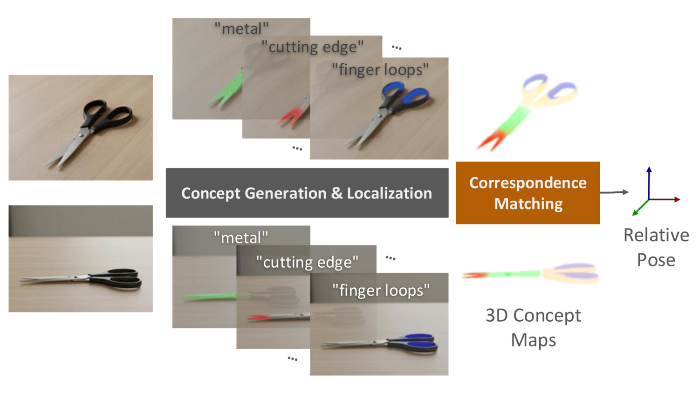
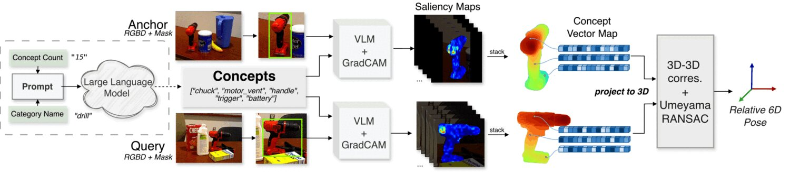

# ConceptPose: Training-Free Zero-Shot Object Pose Estimation using Concept Vectors

Official implementation of **ConceptPose** (CVPR 2026). [[Project Page]](https://stevenkuang.github.io/conceptpose/) [[arXiv]](https://arxiv.org/abs/2512.09056)

<p align="center">
  
</p>

Training-free zero-shot 6D object pose estimation using semantic concept saliency from vision-language models.

## Method

<p align="center">
  
</p>

ConceptPose generates a set of concepts (e.g., "chuck", "handle", "trigger") for a given object category using an LLM, then localizes each concept via VLM GradCAM saliency maps. These concepts are not limited to semantic parts — they can be materials, affordances, or any visually grounded attribute. The per-concept saliency maps are stacked into 3D Concept Vector Maps, which establish dense correspondences between an anchor and query view. Relative 6D pose is recovered via Umeyama RANSAC on the 3D-3D correspondences.

## Installation

```bash
pip install -e .
```

**Additional dependencies** (install separately):

- [PyTorch3D](https://github.com/facebookresearch/pytorch3d) — required for BOP VSD metric rendering
  ```bash
  pip install "git+https://github.com/facebookresearch/pytorch3d.git@stable"
  ```

The following are only needed for the **in-the-wild demo** (`wild_pose_estimator.py`):

- [SAM3](https://github.com/facebookresearch/sam3) — object segmentation via text prompt. Requires `transformers` installed from the main branch:
  ```bash
  pip install git+https://github.com/huggingface/transformers
  ```
  You also need to request access to the [facebook/sam3](https://huggingface.co/facebook/sam3) checkpoint on HuggingFace, then authenticate:
  ```bash
  huggingface-cli login
  ```

- [DepthAnything3](https://github.com/ByteDance-Seed/Depth-Anything-3) — monocular metric depth estimation:
  ```bash
  git clone https://github.com/ByteDance-Seed/Depth-Anything-3.git
  cd Depth-Anything-3 && pip install -e .
  ```

## Data Preparation

All BOP datasets are extracted into `data/` following the [BOP format](https://bop.felk.cvut.cz/datasets/). Each zip is extracted into the corresponding dataset directory.

<details>
<summary><b>Oryon Test Splits</b> (required for all evaluations)</summary>

```bash
wget https://github.com/jcorsetti/oryon/releases/download/v1.0.0-data/oryon_data.zip
unzip oryon_data.zip -d data/
```
</details>

<details>
<summary><b>Real275 (NOCS)</b></summary>

```bash
mkdir -p data/nocs
wget http://download.cs.stanford.edu/orion/nocs/obj_models.zip
wget http://download.cs.stanford.edu/orion/nocs/gts.zip
wget http://download.cs.stanford.edu/orion/nocs/real_test.zip
unzip obj_models.zip -d data/nocs/
unzip gts.zip -d data/nocs/
unzip real_test.zip -d data/nocs/
```
</details>

<details>
<summary><b>YCB-Video</b></summary>

```bash
mkdir -p data/ycbv
wget https://huggingface.co/datasets/bop-benchmark/ycbv/resolve/main/ycbv_base.zip
wget https://huggingface.co/datasets/bop-benchmark/ycbv/resolve/main/ycbv_models.zip
wget https://huggingface.co/datasets/bop-benchmark/ycbv/resolve/main/ycbv_test_all.zip
unzip ycbv_base.zip -d data/ycbv/
unzip ycbv_models.zip -d data/ycbv/
unzip ycbv_test_all.zip -d data/ycbv/
```
</details>

<details>
<summary><b>LINEMOD</b></summary>

```bash
mkdir -p data/lm
wget https://huggingface.co/datasets/bop-benchmark/lm/resolve/main/lm_base.zip
wget https://huggingface.co/datasets/bop-benchmark/lm/resolve/main/lm_models.zip
wget https://huggingface.co/datasets/bop-benchmark/lm/resolve/main/lm_test_bop19.zip
unzip lm_base.zip -d data/lm/
unzip lm_models.zip -d data/lm/
unzip lm_test_bop19.zip -d data/lm/
```
</details>

<details>
<summary><b>LINEMOD-Occlusion (LM-O)</b></summary>

```bash
mkdir -p data/lmo
wget https://huggingface.co/datasets/bop-benchmark/lmo/resolve/main/lmo_base.zip
wget https://huggingface.co/datasets/bop-benchmark/lmo/resolve/main/lmo_models.zip
wget https://huggingface.co/datasets/bop-benchmark/lmo/resolve/main/lmo_test_all.zip
unzip lmo_base.zip -d data/lmo/
unzip lmo_models.zip -d data/lmo/
unzip lmo_test_all.zip -d data/lmo/
```
</details>

<details>
<summary><b>Toyota-Light (TYO-L)</b></summary>

```bash
mkdir -p data/tyol
wget https://huggingface.co/datasets/bop-benchmark/tyol/resolve/main/tyol_models.zip
wget https://huggingface.co/datasets/bop-benchmark/tyol/resolve/main/tyol_test_bop19.zip
unzip tyol_models.zip -d data/tyol/
unzip tyol_test_bop19.zip -d data/tyol/
```
</details>

### Expected Directory Structure

After extraction, verify that your `data/` directory matches the structure below. The code expects these exact relative paths — if your zips extract differently, reorganize to match.

<details>
<summary>Click to expand</summary>

```
data/
├── oryon_data/                        # Oryon fixed test splits
│   ├── ycbv/fixed_split/
│   ├── lm/fixed_split/
│   ├── nocs/
│   └── toyl/
├── nocs/                              # Real275 (NOCS)
│   ├── obj_models/
│   │   └── real_test/                 # 3D mesh models (.obj)
│   ├── real_test/                     # Test scenes
│   │   └── scene_{1..6}/
│   └── gts/
│       └── real_test/                 # Ground truth poses (.pkl)
├── ycbv/                              # YCB-Video (BOP format)
│   ├── ycbv_base/
│   │   └── test_targets_bop19.json
│   ├── models/
│   │   └── models/                    # 3D mesh models (.ply)
│   └── test/
│       └── {000048..000059}/          # 12 test scenes
├── lm/                                # LINEMOD (BOP format)
│   ├── lm_base/
│   │   └── test_targets_bop19.json
│   ├── lm_models/
│   │   └── models/                    # 3D mesh models (.ply)
│   └── test/
│       └── {000001..000015}/          # 15 test scenes
├── lmo/                               # LINEMOD-Occlusion (BOP format)
│   ├── lmo_base/
│   │   └── test_targets_bop19.json
│   ├── lmo_models/
│   │   └── models/                    # 3D mesh models (.ply)
│   └── test/
│       └── 000002/                    # 1 test scene
└── tyol/                              # Toyota-Light (BOP format)
    ├── tyol_models/
    │   └── models/                    # 3D mesh models (.ply)
    └── tyol_test_bop19/
        └── test/
            └── {000001..000021}/      # 21 test scenes
```
</details>

Dataset root paths are configured in `configs/datasets/*.json`. Update the `paths.root` field if your data is stored elsewhere.

## One-Shot Evaluation

Evaluate one-shot 6D pose estimation on standard benchmarks:

```bash
# Real275 (NOCS)
python test_oneshot.py --config configs/evaluations/oneshot_real275_oryon_cross_scene.yaml

# YCB-Video
python test_oneshot.py --config configs/evaluations/oneshot_ycbv_oryon_2k.yaml

# LINEMOD
python test_oneshot.py --config configs/evaluations/oneshot_lm_oryon_2k.yaml

# LINEMOD-Occlusion
python test_oneshot.py --config configs/evaluations/oneshot_lmo_full.yaml

# TYO-L
python test_oneshot.py --config configs/evaluations/oneshot_tyol_full.yaml
```

Configure dataset paths in `configs/datasets/*.json` before running.

## In-the-Wild Demo

Estimate 6D pose from arbitrary image pairs (no dataset setup required):

```bash
python -m concept_pose.demo.wild_pose_estimator \
    --reference <path_to_reference_image> \
    --query <path_to_query_image> \
    --object_name <object_category>
```

This pipeline uses DepthAnything3 for monocular depth and SAM3 for segmentation.

## Project Structure

```
concept-pose/
├── test_oneshot.py              # Main evaluation entry point
├── configs/
│   ├── datasets/                # Dataset path configs (real275, ycbv, lm, lmo, tyol)
│   └── evaluations/             # Evaluation configs (one per dataset)
└── concept_pose/
    ├── core/                    # Voxelizer, normalization, point cloud, projection
    ├── data/                    # Dataset loaders (Real275, TYOL, YCB-V, LM, LMO)
    ├── demo/                    # In-the-wild pose estimator
    ├── evaluation/              # One-shot evaluator, pair sampler
    ├── partonomy/               # Semantic part labels
    ├── pose/                    # One-shot pose estimator, registration, metrics
    ├── saliency/                # SigLIP2, CLIP, DINOtxt saliency generators
    └── utils/                   # Config, paths, memory, visual utilities
```

## Citation

```bibtex
@inproceedings{kuang2026conceptpose,
    title={ConceptPose: Training-Free Zero-Shot Object Pose Estimation using Concept Vectors},
    author={Kuang, Liming and Velikova, Yordanka and Saleh, Mahdi and Zaech, Jan-Nico and Paudel, Danda Pani and Busam, Benjamin},
    booktitle={IEEE/CVF Conference on Computer Vision and Pattern Recognition (CVPR)},
    year={2026}
}
```

## License

MIT License
